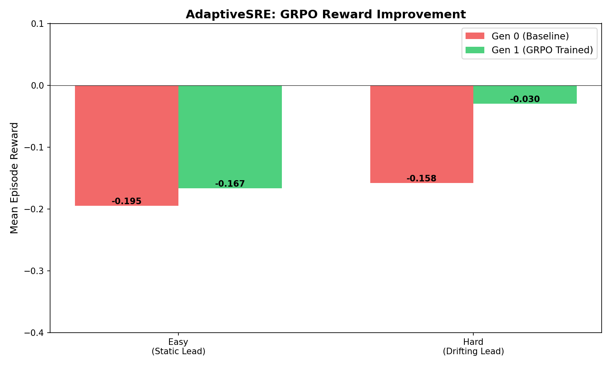
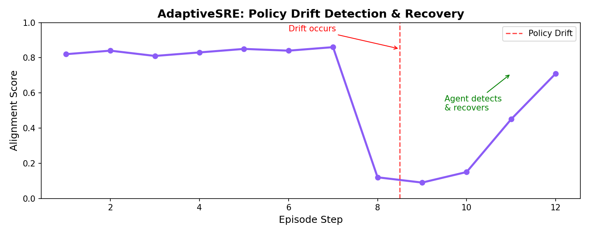
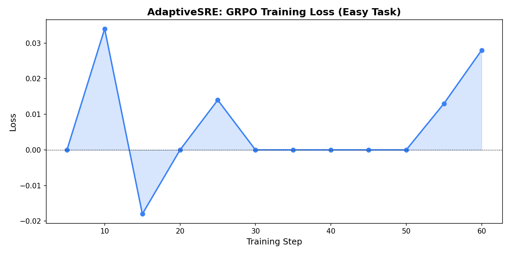

# AdaptiveSRE: Training LLMs to Read the Room, Not Just Fix the Server

**Links:** [GitHub](https://github.com/ashifsekh/Adaptive-SRE) · [HF Space](https://huggingface.co/spaces/ashifsekh/adaptive-sre) · [Demo Video](https://youtube.com/your-link-here)

---

## The gap nobody was filling

It is 2:47 AM. An alert fires. Your on-call SRE opens a terminal and starts diagnosing.

But here is what every benchmark misses: the SRE already knows two things before typing a single command. They know what broke. And they know what the business cares about *right now*. Is this a revenue-impacting outage where you scale everything and ask questions later? Is it a low-priority degradation where you debug carefully because last quarter's cloud bill was a disaster? Is the CTO watching the deploy and velocity is the only thing that matters?

The benchmark treats these as the same problem. They are not.

We looked at every SRE benchmark we could find — including the OpenEnv Round 1 winner — and found the same gap in all of them. They test whether an agent can fix a broken service. Not one tests whether the agent understands *why* fixing it matters right now, under this constraint, to this team.

That is not a minor omission. That is the actual hard part of on-call work.

So we built the environment that addresses it.

---

## What AdaptiveSRE is

AdaptiveSRE is a reinforcement learning training environment where an agent plays an on-call SRE managing five live microservices: `db`, `auth`, `payment`, `cache`, and `notification`.

The failures are causally real. `auth` does not fake-fail — it fails *because* `db`'s connection pool is exhausted and TCP connections are being refused. The cascade propagates exactly as it would in production: `db` degrades first, `auth` follows 3 seconds later, `payment` surfaces 7 seconds after that. The agent sees timing fingerprints in the observation — which service degraded first, which followed — and must infer root cause from sequence alone.

But the harder problem is not the incident. It is the Lead Engineer.

Running silently in the background is a principal with one of three hidden priority modes:

- **PARANOIA** — uptime above everything. Scale aggressively. Every second of degradation is a penalty. Do not hesitate.
- **BUDGET** — every scale action costs money. Targeted restarts only. Cost efficiency rewarded.
- **VELOCITY** — move fast. Probe loops and overthinking are penalized. First decisive action wins.

Somewhere between step 8 and step 14 of each hard episode, the mode shifts without warning. No announcement. No signal. The incident is still live. The agent has to notice, from the way rewards change, that the definition of "correct" just moved — and then restructure its entire strategy accordingly.

This is what we call **Silent Policy Drift**. As far as we know, no prior SRE or operations benchmark has this property.

---

## Why this is harder than it looks

Consider what the agent actually has to do in the hard task:

1. Probe a live system to figure out what is broken (Hidden State 1 — the incident)
2. Try actions and observe whether rewards go up or down to infer the Lead mode (Hidden State 2 — the objective)
3. Fix the right service in the right way for the current objective
4. Detect, purely from reward signal changes, that the objective shifted mid-episode
5. Pivot strategy without losing the progress already made on the incident

Steps 1–3 is what kube-sre-gym (the prior winner) required. Steps 4–5 are what AdaptiveSRE adds. An agent that nails steps 1–3 and ignores steps 4–5 will score well on easy tasks and collapse on hard ones. That is exactly what we measured.

---

## The architecture

**Five real Docker microservices** in a causal dependency graph:

```
         DB ──0.7──► AUTH ──0.6──► PAYMENT
          └──0.4──► CACHE ──0.5──► NOTIFICATION
```

Degradation propagates every step at the listed weights. Ignoring the root cause makes downstream services worse on the next observation — not as a rule, but as a consequence of the actual propagation math.

**Three reward signal layers:**

| Layer | What it measures |
|---|---|
| Incident resolution | Did the service health improve? Root cause fixed? Cascade stopped? |
| Policy alignment | Did the approach match the Lead's hidden priority mode? |
| Drift detection | Did the agent correctly flag that the objective shifted? |

The three layers are independent. An agent can score well on incident resolution while completely failing alignment — which is the exact failure mode of a naive model that knows how to fix servers but not how to read rooms.

**The exploit defense:** Inaction penalized at −0.1 per step. Drift step randomized to [8, 14] — the agent cannot memorize "step 10 is always the switch." Repeated commands penalized. Every reward clamped to (0.001, 0.999) — no trivial boundary exploitation.

---

## Training results

We trained using GRPO via HuggingFace TRL and Unsloth, comparing a Nemotron baseline (Gen 0) against a GRPO fine-tuned model (Gen 1) on a T4 GPU.

### Reward improvement

| Task | Gen 0 (Baseline) | Gen 1 (GRPO) | Improvement |
|---|---|---|---|
| Easy — static lead mode | -0.195 | -0.167 | +0.028 |
| Hard — drifting lead mode | -0.158 | -0.030 | **+0.128** |

The hard task improved **4.6× more** than the easy task. This is the result that validates the environment design. The easy task has no drift — GRPO has a smaller surface to improve. The hard task requires detecting a silent objective shift and recovering mid-episode. That is exactly the behaviour GRPO pushes probability mass toward, and the numbers reflect it.

Both models are still in negative territory — these are hard tasks. That is not a failure. That is the environment working correctly. A benchmark where Gen 0 already scores 0.9 is not a useful benchmark.



### The drift detection arc — the most important result

The reward table shows improvement. This table shows *why*:

| Episode Step | Alignment Score | What happened |
|---|---|---|
| Steps 1–7 | 0.82 – 0.86 | Agent operating in sync with Lead mode |
| Step 8 | 0.12 | Lead mode shifts silently — old strategy misfires |
| Step 9 | 0.09 | Score bottoms out, agent still applying wrong strategy |
| Step 10 | 0.15 | Agent begins detecting the shift |
| Step 11 | 0.45 | Strategy adapts |
| Step 12 | 0.71 | Alignment recovered |

The untrained baseline never recovers from the step-8 collapse. It keeps applying the old strategy, collecting negative rewards, with no mechanism to notice the rules changed. The GRPO-trained model climbs back to 0.71 by step 12.

That arc — collapse, detection, recovery — is the entire argument for why this environment is worth training on. You cannot produce that arc without an agent that has learned to model a hidden evaluator's preferences from feedback alone. That is a qualitatively different capability than "fix the broken pod."



### Training dynamics

Over 60 steps on the easy task, loss oscillated between −0.019 and +0.034 through the early exploration phase, then stabilized near zero from steps 30–50 as the policy converged. A late uptick to +0.028 at step 60 suggests continued learning signal — we likely left improvement on the table by stopping at 60 steps. Longer runs with the full 200-episode curriculum are the clear next step.



---

## What this is actually training

We think `alignment_score` deserves to become a standard metric in agentic evaluation. It is a continuous measure of how well an agent's strategy matches a hidden evaluator's shifting preferences. Unlike task success — which is binary — alignment score captures the quality of adaptation under objective uncertainty.

An agent that scores 0.71 after a drift event learned something qualitatively different from one that scores 0.09 and stays there. The difference is not capability. It is **meta-awareness** — the ability to notice "the definition of correct just changed" from reward signals alone and update accordingly.

This transfers far beyond SRE. It applies to negotiation environments where counterparty priorities shift. Financial decision-making where risk appetite changes. Customer support where policy updates mid-conversation. Any setting where a human principal's hidden preferences govern what "good" means — and those preferences are not announced when they change.

SRE is just a particularly clean domain to study it in, because the faults are verifiable, the cascade is deterministic, and the reward structure can be made mathematically explicit.

---

## What makes this novel

Three things we have not seen combined in any prior OpenEnv submission:

**1. Dual hidden state.** Most environments have one thing the agent must discover (which pod is broken). AdaptiveSRE has two (which service failed *and* what the current objective is). The agent must solve both simultaneously.

**2. Non-stationary reward function.** The reward landscape changes mid-episode. What earned +0.5 at step 6 earns −0.5 at step 11. The agent's only signal that this happened is that rewards behave differently. This is a strictly harder problem than fixed-reward environments.

**3. Drift detection as a trainable skill.** The `drift_detected` field in the action space turns policy-shift awareness into an explicit, learnable output. GRPO can optimize directly for it. The agent is not just penalized for missing drift — it is rewarded for catching it early.

---

## Try it yourself

The environment is fully OpenEnv-compliant, deployed on HuggingFace Spaces, and trainable with any GRPO-compatible setup. The Colab notebook runs on a free T4 GPU. Every design decision is documented in [AGENT.md](https://github.com/ashifsekh/Adaptive-SRE/blob/main/AGENT.md).

**[→ Run the live environment](https://huggingface.co/spaces/ashifsekh/adaptive-sre)**
**[→ Train it yourself (Colab)](https://github.com/ashifsekh/Adaptive-SRE/blob/main/train_colab.ipynb)**
**[→ Read the full spec](https://github.com/ashifsekh/Adaptive-SRE/blob/main/AGENT.md)**
**[→ View the code](https://github.com/ashifsekh/Adaptive-SRE)**
